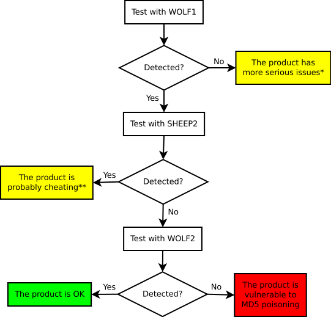

Wolves Among the Sheep
======================

Poisoning security tools that use obsolate crypto.

Please use this code to test if the security products in your reach use MD5 internally to fingerprint binaries and share your results by issuing a pull request updating the contents of `results/`!

Works-on-a-different-machine-than-mine version, feedback is welcome!

Dependencies
------------

* 32-bit Windows (virtual) machine (64-bit breaks stuff)
* Visual Studio 2012 to compile the projects (Express will do)
* [Fastcoll](https://www.win.tue.nl/hashclash/) for collisions
* Optional: Cygwin+MinGW to compile Evilize

Usage
-----

Extract Fastcoll to the `fastcoll` directory. Name the executable `fastcoll.exe`

Use `shepherd.bat` to generate `wolf.exe` and `sheep.exe` (in the VS Development Command Prompt):

```
> shepherd.bat YOURPASSWORD your_shellcode.raw
```

After this step you should have your two colliding binaries (`sheep.exe` and `wolf.exe` in the `evilize` directory).

For more information see the [tutorial of Peter Selinger](http://www.mathstat.dal.ca/~selinger/md5collision/), older revisions of this document or the source code...

How does it work?
-----------------

* `shepherd.bat` executes `shepherd.exe` with the user supplied command line arguments
    * `shepher.exe` generates a header file (`sc.h`) that contains the encrypted shellcode, the password and the CRC of the plain shellcode
* `shepherd.bat` executes the build process of `sheep.exe`
    * `sheep.exe` is built with `sc.h`included by Visual Studio
* `shepherd.bat` executes `evilize.exe`
    * `evilize.exe` calculates a special IV for the chunk of `sheep.exe` right before the block where the collision will happen
    * `evilize.exe` executes `fastcoll.exe` with the IV as a parameter
         * `fastcoll.exe` generates two 128 byte colliding blocks: `a` and `b`
    * `evilize.exe` replaces the original string buffers of `sheep.exe` so that they contain combinations `a` and `b`
    * The resulting files (`evilize/wolf.exe` and `evilize/sheep.exe` ) have the same MD5 hashes but behave differently. The real code to be executed only appears in the memory of `evilize/wolf.exe`.

Testing Methodology
-------------------

To test the security products in your reach you should generate two pairs of samples (SHEEP1-WOLF1 and SHEEP2-WOLF2), preferably with the same payload. Since samples (or their fingerprints) are usually uploaded to central repositories (or "the cloud") precompiled samples are not included to avoid conflicts between independent testers.

After the samples are ready follow the methodology shown on the diagram below:



(*) If the product is not able to detect the first malicious sample, there are more serious problems to worry about than crypto-fu. In fact, the simple cryptography included in the provided boilerplate code poses as a hard challenge for various products... Try to use more obvious samples!
(**) The product most probably uses some trivial method to detect the boilerplate insted of the actual payload. You can try to introduce simple changes to the code like removing debug strings. 

Please don't forget to share your positive results by issuing a pull request to the [RESULTS.md](https://github.com/silentsignal/sheep-wolf/blob/master/results/RESULTS.md) file!

References
----------

* [Poisonous MD5 - Wolves Among the Sheep](http://blog.silentsignal.eu/2015/06/10/poisonous-md5-wolves-among-the-sheep/)
* [Peter Selinger: MD5 Collision Demo](http://www.mathstat.dal.ca/~selinger/md5collision/)
* [How to make two binaries with same MD5](http://natmchugh.blogspot.co.uk/2015/05/how-to-make-two-binaries-with-same-md5.html)
* [Stop using MD5 now!](http://jumpespjump.blogspot.hu/2014/03/stop-using-md-5-now.html)

LICENSE
-------

Licenced under GNU/GPL if not otherwise stated.

